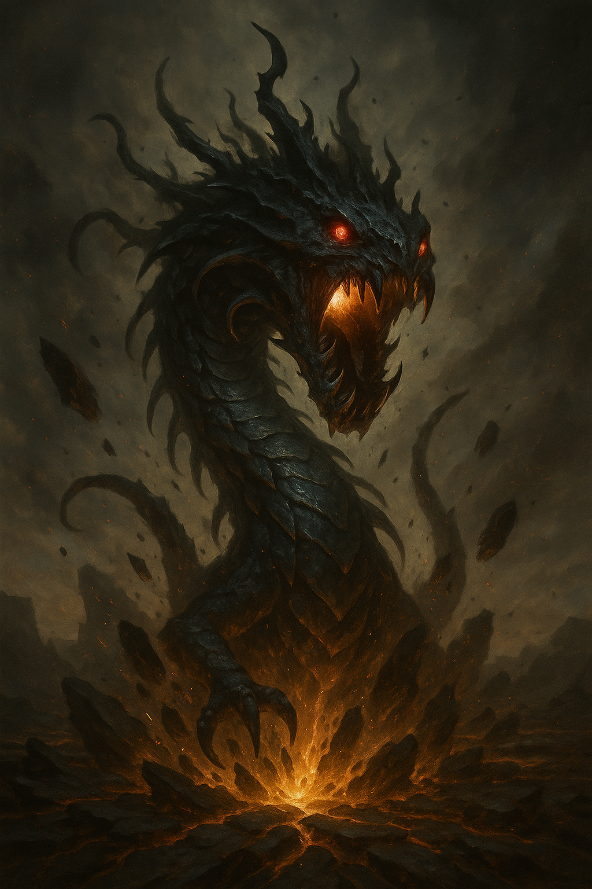

## The Abyssal Maw

*"It does not speak. It only waits."*

**Faction**: Dark  
**Origin**: Temple of the Astrals  
**Role**: Devourer  
**Sanctuary**: The Deep Sanctum  
**Weapon**: None — only Hunger

---

Lurking deep within the **Temple of the Astrals**, past crumbling stairs and forgotten rites, dwells a presence ancient and unknowable. **The Abyssal Maw** does not move. It does not hunt. It simply waits — for those bold or foolish enough to seek the Magical Stones within the sacred halls.

Legends whisper that it was born in the wake of the **Great Shattering** — a creature formed from the very trauma of the explosion, where divine energy collapsed into primal hunger. Whether it is a guardian or a curse is no longer clear.

Its lair, known as the **Deep Sanctum**, is a place where echoes do not return, and even light seems to recoil. To enter the Temple is to enter its jaws. Few return.

---

### 🕊 Gameplay Effect

> *When an opponent claims a magical stone, they have to return it.*

---

### 🃏 Tarot Meaning

**Upright** — *Inevitability, consumption, irresistible force, consequence.*  
Some hungers cannot be denied. Some endings cannot be averted.

**Reversed** — *Parasitism, manipulation, blind desire, hidden threat.*  
What you think is power may in truth be feeding something far greater — and far more dangerous.
