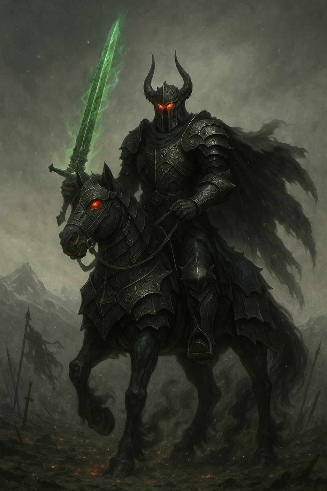

## The Dark Knight

*"What is a vow worth, if not sharpened by betrayal?"*

**Faction**: Dark  
**Origin**: The Abyssal Reach  
**Role**: Enforcer  
**Sanctuary**: The Black Citadel  
**Weapon**: Blightreign Blade

---

Once a noble protector of **Palmyria**, the one now known as **The Dark Knight** vanished during the chaos of the **Great Shattering**. When he returned, he wore not honor, but silence — clad in infernal black steel, face forever sealed behind a spiked helm.

He serves the **Dark Lord** without question, a towering specter of wrath and obedience. Some believe his soul was broken, others that it was willingly given. Wherever he rides, ruin follows — and those who once called him brother now cross themselves in dread.

Within the obsidian walls of the **Black Citadel**, he trains an army not of soldiers, but of executioners. His blade, the **Blightreign**, sings only in death — a dirge for kingdoms forgotten and kings betrayed.

---

### 🕊 Gameplay Effect

> *Quickplay. Cancel The Sorceress when she targets your stone.*

---

### 🃏 Tarot Meaning

**Upright** — *Fallen honor, duty twisted, silent strength, grim resolve.*  
The protector becomes the oppressor. Yet even in shadow, discipline endures.

**Reversed** — *Unquestioning loyalty, blindness to consequence, vengeance misdirected.*  
When you forget why you fight, you become the very thing you once feared.
