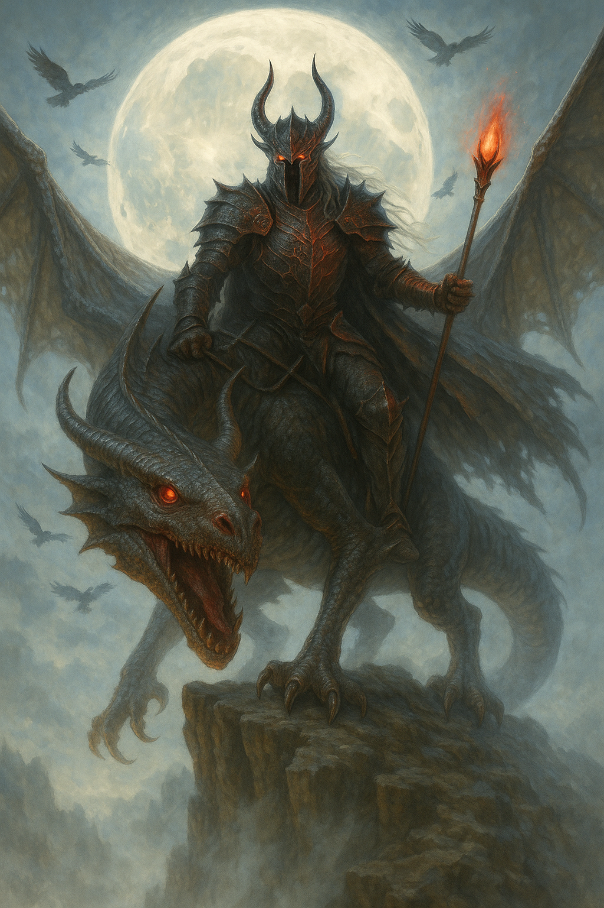

## The Dark Lord

*"They abandoned their creation. I will perfect it."*

**Faction**: Dark  
**Origin**: The Abyssal Reach  
**Role**: Faction Leader of Darkness  
**Sanctuary**: The Black Citadel  
**Weapon**: The Crimson Staff of Dominion  
**Mount**: Vhar'Zul, the Fell Dragon

---

Before the world shattered, he stood at the right hand of the Astrals — a guardian, a chosen. But when they turned their gaze away, he did not.

Where others wept or wandered after the **Great Shattering**, he watched the world unravel. Then he acted.

**The Dark Lord** seeks not revenge, but *order* — his order. A new world, shaped by dominion and enforced by strength. One where the weak are ruled, where peace is hammered in fire, and where the Astrals, if they ever wake, will find their mercy obsolete.

From the volcanic wastes of the **Abyssal Reach**, he watches astride **Vhar'Zul**, the Fell Dragon — a beast of shadow flame and ancient wrath. With every beat of its wings, ruin rides.

He commands the Ravager and the Dark Knight. His will echoes through the Black Citadel and into the bones of Nytherria.

---

### 🕊 Gameplay Effect

> *Faction Leader. Take all Dark-faction character cards from all opponents’ hands.*

---

### 🃏 Tarot Meaning

**Upright** — *Domination, ruthless vision, leadership through fear, destiny claimed.*  
You hold the power to reshape your world — but beware: in doing so, the world will reshape you.

**Reversed** — *Tyranny, delusion, false gods, crumbling foundations.*  
Your pursuit of control may blind you. Rule built on fear may last long — but never forever.
