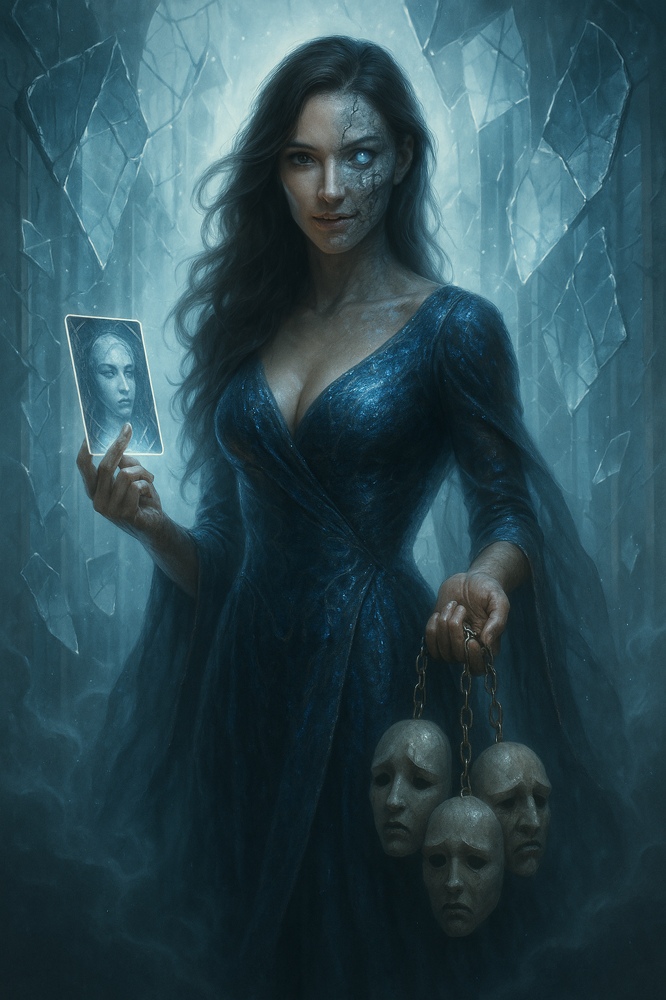

## The Deceiver

*"Trust is a luxury you cannot afford."*

**Faction**: Dark  
**Origin**: The Whispering Woods  
**Role**: Master of Illusion  
**Sanctuary**: Hall of Hollow Faces  
**Weapon**: Chains of Masks, False Tarot

---

She once wore the face of a saint, another time a sister, once even a king’s savior. Each mask she dons becomes a truth for someone — until it isn’t.

**The Deceiver** is the shadow behind the throne, the whisper in the loyal ear, the shape that shifts to fit your desires… until she breaks them.

Second only to **The Dark Lord**, she acts as his agent, emissary, and executioner. Not out of loyalty to the cause — for she holds no true allegiance — but out of devotion to *him* alone. Her love is twisted, absolute, and terrifying.

She weaves plots within plots across all of Nytherria. No region is untouched by her whispers, no stronghold entirely safe. To speak with her is to risk forgetting who you are.

---

### 🕊 Gameplay Effect

> *Declare this card as any character (except a Faction Leader) and resolve its effect.*

---

### 🃏 Tarot Meaning

**Upright** — *Deception, disguise, manipulation, secret knowledge.*  
Not all lies are malicious. Some save lives. But truth — true truth — is never easy to recognize.

**Reversed** — *Loss of identity, betrayal, unraveling illusions, paranoia.*  
You have worn too many faces. Beware: the last one may be yours forever.
