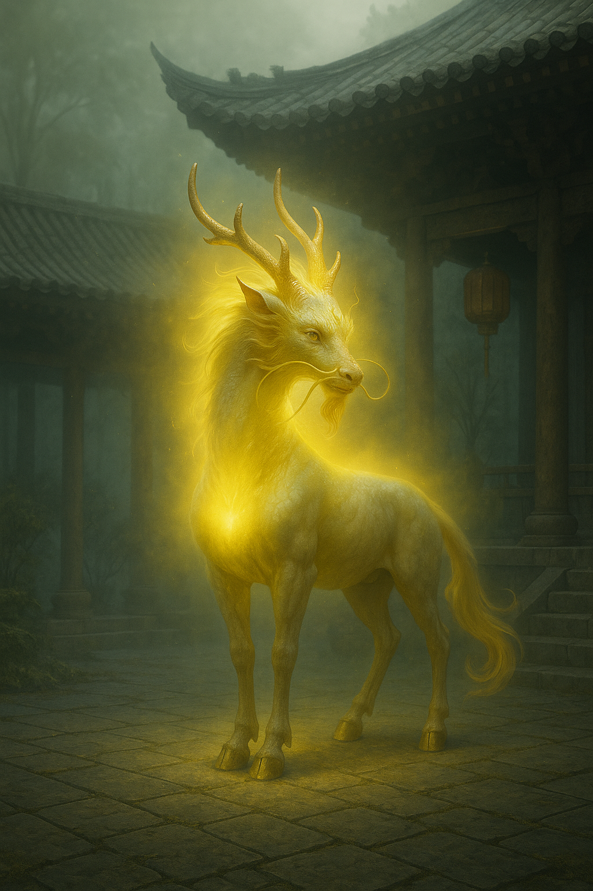

## The Guardian

*"I was forged before memory, and I will stand after it."*

**Faction**: Light  
**Origin**: The Sacred Peaks  
**Role**: Celestial Protector  
**Sanctuary**: The Skyward Gate  
**Weapon**: None — its presence alone wards the darkness

---

Few have seen **The Guardian** up close — and fewer still have lived to speak of it. It is a **Qilin of purest light**, cloaked in golden fire, whose four limbs touch the air like echoes of thunder. Its eyes blaze sapphire, eternal and sorrowful.

It does not speak. It remembers.

Legends say it was awakened in the first breath of the world, tasked by the Astrals to guard the boundary between realms. When the **Great Shattering** tore the sky and earth apart, it did not falter.

To this day, **The Saint** calls it her most faithful companion — though she has never claimed to command it.

It simply stands where it is needed.

---

### 🕊 Gameplay Effect

> *Quickplay. Cancel The Reaper when it targets you.*

---

### 🃏 Tarot Meaning

**Upright** — *Protection, vigilance, divine guardianship, resolve.*  
You are shielded, even if you do not see it. Something ancient and powerful watches over your path.

**Reversed** — *Neglected defense, overconfidence, spiritual vulnerability.*  
You may be leaving yourself exposed — or relying too heavily on a shield that no longer stands. Rebuild your wall.
