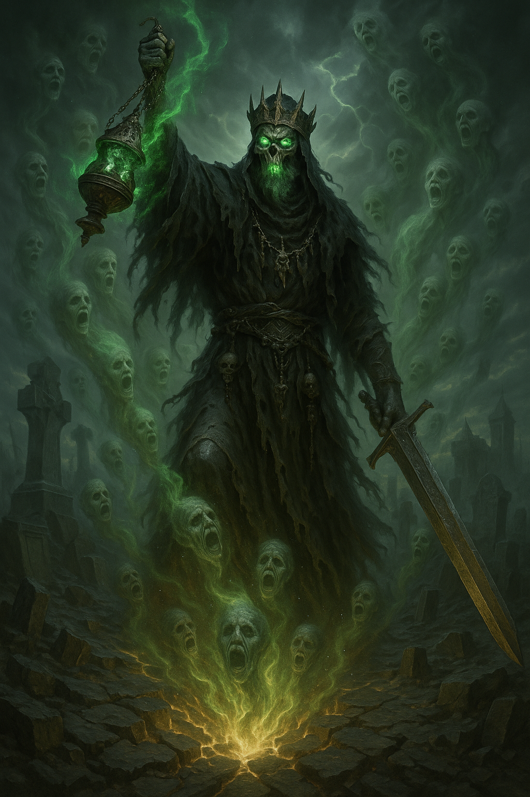

## The Harbinger

*"When the sky cracks and silence weeps, I shall rise again."*

**Faction**: Undead  
**Origin**: The Land of the Dead  
**Role**: Faction Leader of the Undead  
**Sanctuary**: The Mausoleum of Echoes  
**Weapon**: Greatsword of Silence and Censer of Mourning

---

None remember the name he bore in life. Some whisper he was a king struck down during the **Great Shattering**; others claim he was the first to fall when the **Stone of Life** erupted. Whatever the truth, **The Harbinger** now roams the **Land of the Dead**, clad in ceremonial armor tarnished by centuries, carrying a **greatsword etched with burial rites** and a **censer that trails ghostfire**.

He is both executioner and death-priest — a figure of dread and reverence. His blade ends what breath remains; his censer sanctifies the void it leaves behind. When he walks, the air grows still, and even time seems to hold its breath.

He does not crave power. He heralds the inevitable — the crumbling of all things, the descent into stillness. His arrival is not war, but warning.

---

### 🕊 Gameplay Effect

> *All players must discard all but 1 of their cards to the graveyard.*

---

### 🃏 Tarot Meaning

**Upright** — *Inevitable change, reckoning, the end before renewal.*  
He arrives not to destroy — but to remind. Nothing lasts forever.

**Reversed** — *Fear of death, resistance to fate, clinging to ruin.*  
To delay the end is to suffer it twice.
