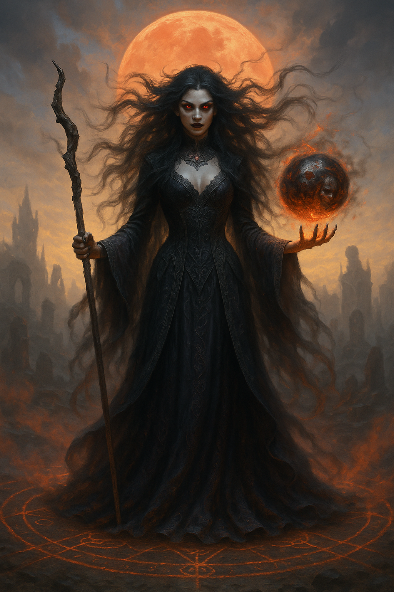

## The Hex

*"Mercy? I gave it to them once. They returned it with chains."*

**Faction**: Dark  
**Origin**: The Whispering Woods  
**Role**: Vengeful Witch  
**Sanctuary**: The Ruined Altar  
**Weapon**: Bone Staff of Binding

---

Once a faithful handmaiden of the Astrals, she served in silence within the sacred halls of the ancient temple. But after the **Great Scattering**, she witnessed what came next — the kingdoms of men turned against one another, corrupted by greed, desecrating what was once divine.

Her faith shattered. Her heart twisted.

**The Hex** now walks the ruins with eyes that burn with crimson hatred. She seeks not redemption, but *vengeance* — against humankind, against their kings, and against the weakness that once made her beg for their approval.

Her sanctuary, the **Ruined Altar**, lies deep within the **Whispering Woods** — once a forgotten outpost of the Temple, now overtaken by thorn and rot. It was there she gave her final prayer… and received no answer.

---

### 🕊 Gameplay Effect

> *Steal 1 magical stone from an opponent.*

---

### 🃏 Tarot Meaning

**Upright** — *Power reclaimed, vengeance, righteous fury, severing ties.*  
To stand tall after betrayal is power in itself. You no longer need permission to be dangerous.

**Reversed** — *Hatred, obsession, collateral damage, corrupted purpose.*  
Vengeance can burn brighter than justice — but it consumes everything, even you.
