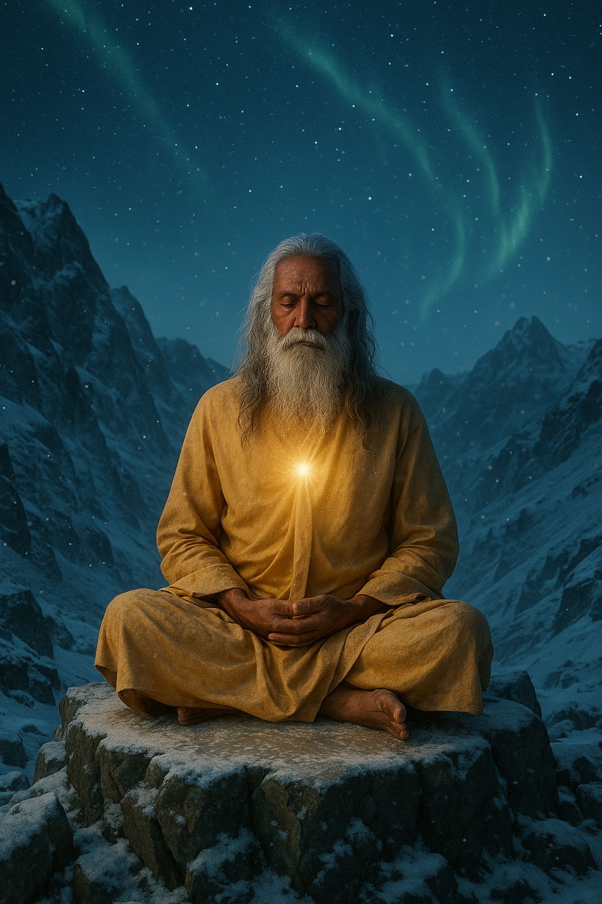

## The Luminary

*"To ascend the world, one must first let go of it."*

**Faction**: Light  
**Origin**: The Sacred Peaks 
**Role**: Sage of the Silent Heights  
**Sanctuary**: The Mirror Vault  
**Weapon**: None (wisdom and vision)

---

High upon the storm-bitten crags of the **Sacred Peaks**, where the air thins and even the stars seem distant, a lone figure watches.

**The Luminary** is no warrior, no priest — he is a **seeker**, a man who climbed beyond the noise of kingdoms and firelight in pursuit of truth. He sits alone within the **Mirror Vault**, a crystalline cave beneath the summit, where light bends and futures shimmer like snow in flame.

Those who climb to meet him often do so with desperation in their hearts — and find not judgment, but stillness. The Luminary does not offer answers. He offers the clarity to ask the right questions.

They say he once saw the Astrals in a vision of molten dawn — and in doing so, remembered who he truly was.

---

### 🕊 Gameplay Effect

> *Draw 3 cards, then discard 3 cards.*

---

### 🃏 Tarot Meaning

**Upright** — *Reflection, clarity, spiritual ascent, divine insight.*  
The answers lie within — if you are brave enough to abandon what burdens you. Clarity comes after sacrifice.

**Reversed** — *Isolation, false wisdom, spiritual arrogance, blindness to self.*  
Be wary of mistaking silence for truth. The mountain can reveal, but it can also deceive. Look again — you may have climbed the wrong peak.
