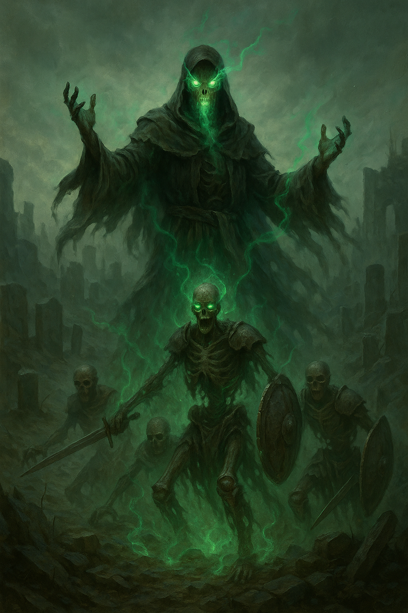

## The Necromancer

*"What is death, but disobedience?"*

**Faction**: Undead  
**Origin**: The Land of the Dead  
**Role**: Necromantic Conjurer  
**Sanctuary**: The Bonewell  
**Weapon**: None — wields pure necromantic magic

---

Unlike his brethren, **The Necromancer** shuns blades and staffs. His power lies in **raw dominion over death itself** — a force bent to his will through sheer mastery, not tools. Once a healer in the age before the **Great Shattering**, he turned to forbidden arts in search of a way to defy mortality. What he found instead was a way to **command it**.

His presence corrodes the veil between life and death. Bones stir at his passing. The long-forgotten rise and whisper their allegiance. Though pale and seemingly withered, his voice can rattle the earth — and in the silence that follows, the dead walk.

He seeks not conquest, but **completion**. Every corpse is an unfinished sentence. And he intends to write the final word.

---

### 🕊 Gameplay Effect

> *Resurrect 2 The Soldier or The Ravager from the graveyard. Play them immediately in any order.*

---

### 🃏 Tarot Meaning

**Upright** — *Reclamation, forbidden talent, animating the past to serve the present.*  
The Necromancer gives form to regret — and commands it to obey.

**Reversed** — *Stagnation, clinging to lost things, failure to let go.*  
Resurrect the past, and it may bury you.
