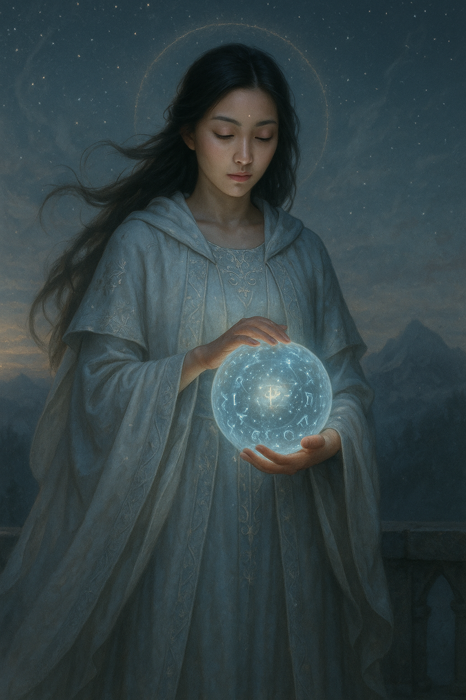

## The Oracle

*"Even the stars forget. I remind them."*

**Faction**: Light  
**Origin**: Palmyria  
**Role**: Seer of the Forgotten Thread  
**Sanctuary**: The Tower Beyond Veil  
**Weapon**: Sight beyond time

---

They say she does not sleep — for sleep would sever her from the thread she weaves.

**The Oracle** lives in solitude, her tower standing just beyond the reach of Palmyria’s sun-kissed walls, perched between shadow and memory. She gazes into still water, into drifting smoke, into the echo of what was — and what may yet come.

She foresaw the **Great Shattering**, though none heeded her warning. Now, with kingdoms broken and magic splintered, she speaks again — not in words, but in visions that burn behind the eyes.

Her gift is not comfort. It is **clarity**, and the courage to bear it.

---

### 🕊 Gameplay Effect

> *On your next turn, play either The Soldier or The Ravager to reveal 3 neutral cards and choose 1 to resolve. Return the other and shuffle the deck.*

---

### 🃏 Tarot Meaning

**Upright** — *Prophecy, insight, intuition, fate's murmur.*  
You are glimpsing the shape of what comes — not to control it, but to prepare. Listen deeply. The future is speaking.

**Reversed** — *False omens, confusion, ignored warning.*  
You may be misreading the signs, or refusing to see them at all. Beware the comfort of ignorance disguised as peace.
