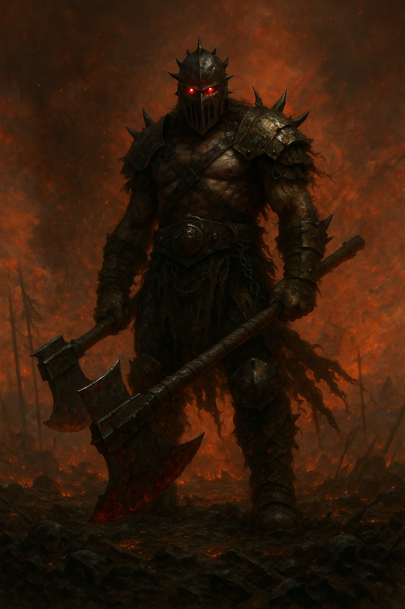

## The Ravager

*"Let the world burn. Let the screams drown the wind."*

**Faction**: Dark  
**Origin**: The Abyssal Reach  
**Role**: Berserker  
**Sanctuary**: The Black Citadel  
**Weapon**: Twin Cleavers of Ruin

---

Spawned in the forges beneath the **Black Citadel**, the **Ravager** is not one, but many. They are the blood-maddened hounds of the **Dark Lord**, warriors stripped of fear, thought, and restraint — reduced to muscle, rage, and instinct. Each one is a former war criminal, sorcerous failure, or cursed soul reshaped into a beast of war.

Ravagers live only to kill. They do not retreat. They do not speak. When unleashed from the **Abyssal Reach**, they descend upon the lands of Nytherria like a plague of blades and screams, their cleavers soaked in the gore of friend and foe alike.

Even their allies fear them. And when the battle ends, the Dark Lord must call them back — or let them slaughter their own.

---

### 🕊 Gameplay Effect

> *Claim a Dark Stone in the neutral deck if revealed.*

---

### 🃏 Tarot Meaning

**Upright** — *Unleashed power, destruction, bloodlust, chaotic force.*  
When reason fails and fire reigns, the Ravager answers.

**Reversed** — *Loss of control, collateral damage, self-destruction.*  
In the frenzy for dominance, one may burn their own path to ash.
