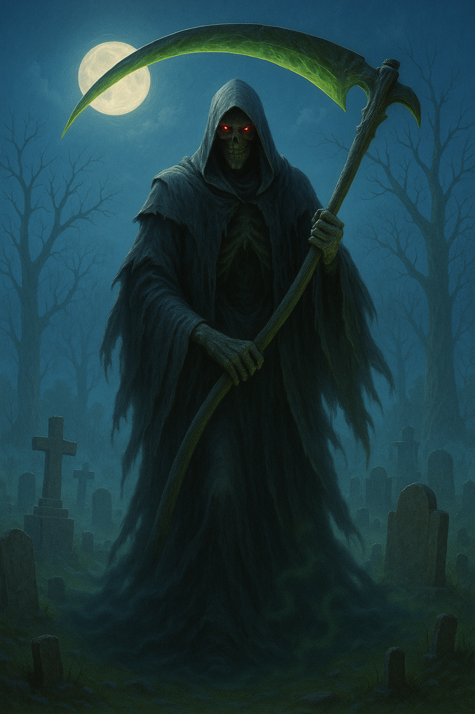

## The Reaper

*"When he walks, even silence holds its breath."*

**Faction**: Undead  
**Origin**: Land of the Dead  
**Role**: Harbinger of Endings  
**Sanctuary**: The Gravepath  
**Weapon**: Soulreaver Scythe

---

Long after the **Great Shattering**, when kingdoms crumbled and the skies wept ash, one figure rose from the forgotten dead — not born of flesh, but of memory, sorrow, and the will to punish. **The Reaper** is not a man. He is an echo.

No one knows who he once was. Some claim he was a fallen knight of Palmyria who lost everything. Others say he is a curse given form — vengeance for the unburied dead of the last war. Cloaked in tattered black, he walks the scorched battlefields and grave-choked wastes of **the Land of the Dead**, dragging behind him a scythe that hums with unspent screams.

To meet his gaze is to feel the weight of every death you've denied, every fate you've postponed. And when he raises his blade, no spell, oath, or plea can save you.

---

### 🕊 Gameplay Effect

> *Banish 1 random card from an opponent’s hand and send it to the Void. They lose their next turn.*

---

### 🃏 Tarot Meaning

**Upright** — *Inevitable change, reckoning, karmic justice, fate fulfilled.*  
He comes not to punish, but to restore the balance. What was taken must be paid.

**Reversed** — *Avoidance, resistance to transformation, fear of loss.*  
You cannot outrun what is already walking behind you.
