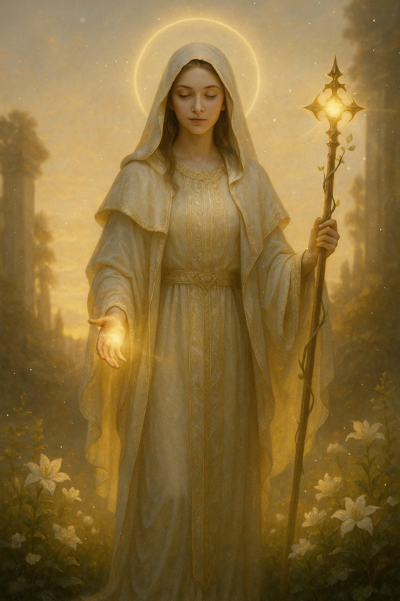

## The Saint

*"Even in death, I do not leave them."*

**Faction**: Light  
**Origin**: The Sacred Peaks  
**Role**: Shepherd of Lost Souls  
**Sanctuary**: The Radiant Chapel  
**Weapon**: A staff bound with remembrance

---

Among the clouds and chimes of **The Sacred Peaks**, where bells toll for no one yet still sing, walks **The Saint** — robed in mourning white, barefoot on wind-swept stone.

She does not speak of the **Great Scattering**, but she walks its ruins in spirit every day. Her touch warms the dead. Her words ease the damned. Her staff, carved from elder wood, bears rings for every soul she has brought back from the edge.

To the wounded, she is salvation. To the lost, a gentle call home. Even the **Guardian**, golden and eternal, walks beside her — for she has never asked him to, and he never needed asking.

She is the **Light that kneels**.

---

### 🕊 Gameplay Effect

> *Resurrect 1 character from the graveyard and resolve its effect immediately. Cannot resurrect a Faction Leader.*

---

### 🃏 Tarot Meaning

**Upright** — *Redemption, healing, mercy, divine intervention.*  
You are being offered a second chance — or the power to give one. Choose compassion. Bring someone — or something — back.

**Reversed** — *Martyrdom, clinging to the past, denial of closure.*  
You may be trying to revive what must stay buried. Let go. Not all wounds heal, and not all ghosts wish to return.
