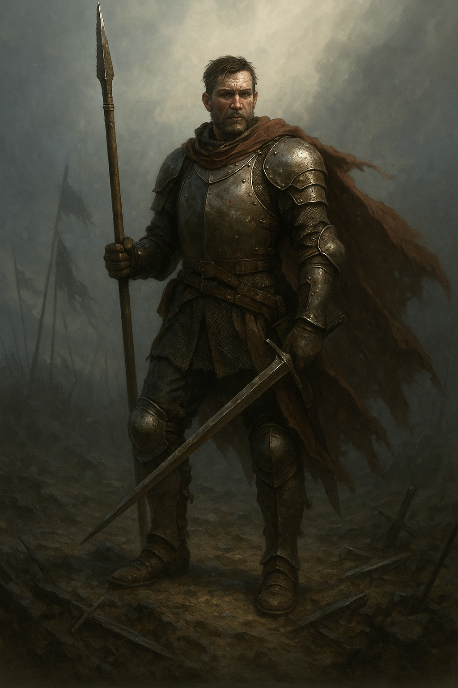

## The Soldier

*"For crown and flame, I stand. Not for glory, but for duty."*

**Faction**: Light  
**Origin**: Palmyria  
**Role**: Vanguard  
**Sanctuary**: The White Citadel  
**Weapon**: Iron Oathblade

---

Every king commands, but not every soul obeys with love. The **Soldier** is one of the few — a sworn blade of **Palmyria**, trained since youth in the arts of discipline, loyalty, and sacrifice. He bears no name in the histories, for he never sought one. His story is etched into the scars of the land he defends.

In the shadow of the **Great Shattering**, he stood by the **King’s** side when others fled. He marched when hope failed. He fought when peace shattered. Now, he continues to serve — not because he believes victory is certain, but because someone must hold the line.

To many, he is the faceless protector. But to those who know, he is the wall that kept the dark tide from swallowing the last kingdom whole.

---

### 🕊 Gameplay Effect

> *Claim a Light Stone in the neutral deck if revealed.*

---

### 🃏 Tarot Meaning

**Upright** — *Loyalty, perseverance, duty fulfilled, selflessness.*  
Even in ruin, the true blade does not falter.

**Reversed** — *Blind obedience, sacrifice without reward, loss of identity.*  
Without purpose, service becomes a prison.
