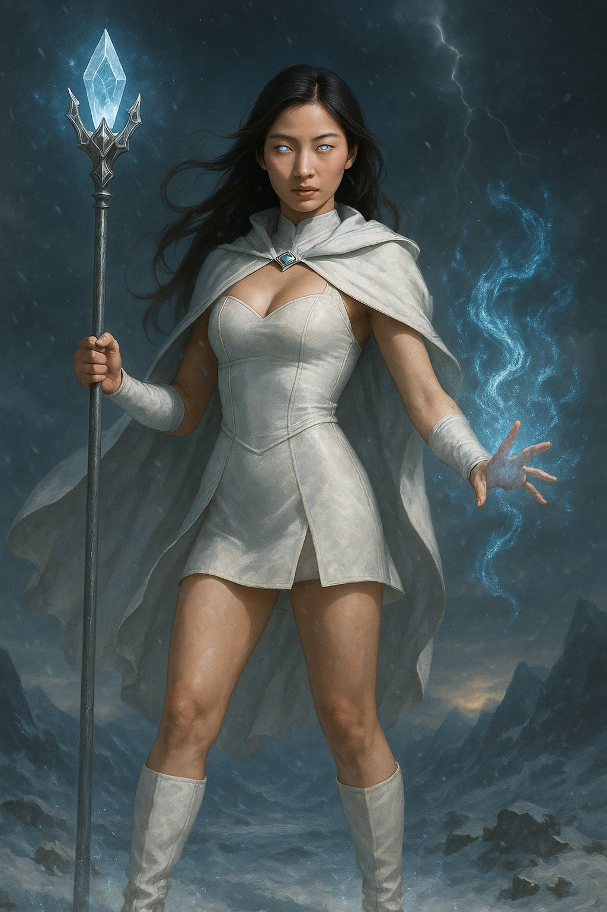

## The Sorceress

*"Magic is not a gift. It is what remains after the gods stop listening."*

**Faction**: Light  
**Origin**: The Sacred Peaks   
**Role**: Warden of the Frozen Runes  
**Sanctuary**: The Glacial Sanctum  
**Weapon**: Sigil-etched staff and arcane frost

---

She withdrew from the world not in fear — but in refusal.

Once a court mage of Palmyria, **The Sorceress** fled to the icy reaches of the **Sacred Peaks** after the Great Shattering, seeking clarity in cold and silence. There, in a glacier-bound sanctum carved with runes older than time, she communes with forces untouched by war.

Her spells are carved in frost, her power drawn from stillness and structure. She does not cast magic — she **restores what has been violated**.

Some call her cruel. Some call her a traitor. But the wise know: she does not punish. She preserves.

---

### 🕊 Gameplay Effect

> *Force an opponent to return 1 magical stone of your choice to the neutral deck.*

---

### 🃏 Tarot Meaning

**Upright** — *Clarity, detachment, arcane mastery, consequence.*  
Let emotion go. What you must do now requires focus and precision. Truth lies not in feeling — but in structure.

**Reversed** — *Coldness, isolation, magical imbalance, moral blindness.*  
You may be turning away too much. Logic without empathy is its own kind of madness. Beware the illusion of being above the fray.
