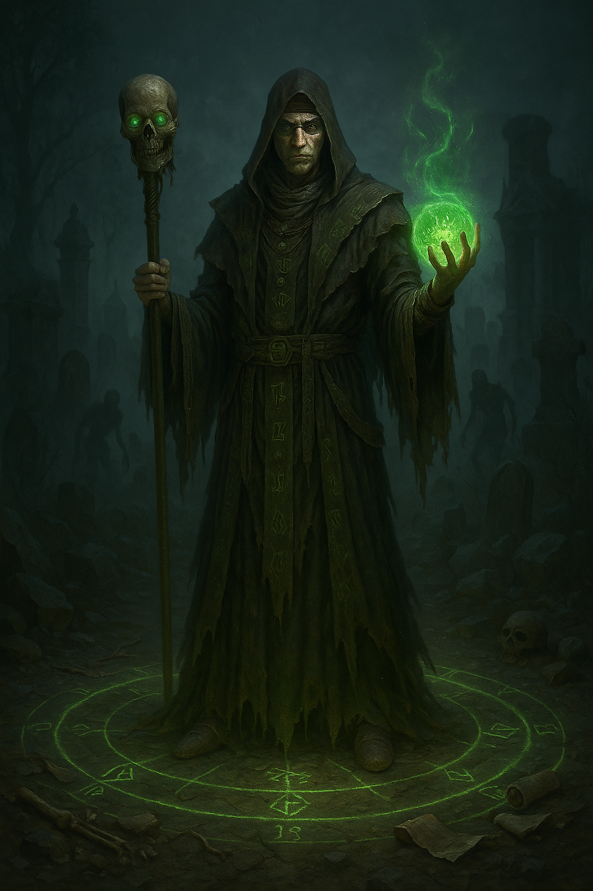

## The Warlock

*"All things die. I merely... remind them."*

**Faction**: Undead  
**Origin**: The Land of the Dead  
**Role**: Necromancer  
**Sanctuary**: The Hollow Spire  
**Weapon**: Skull-topped Staff and Orb of Necromancy

---

Cloaked in silence and ash, **The Warlock** walks the border between life and death, never fully in either. Once a scholar of the arcane, he was exiled from the mortal realms for pursuing forbidden rites — secrets now etched into his very bones. 

He carries a **staff crowned with a skull**, through which he channels the will of the forgotten, and the **Orb of Necromancy**, a cursed relic pulsing with unquiet spirits. It is said the orb was formed from the crystallized eye of a god — and through it, he sees the flow of death itself.

The Warlock does not command the dead. He bargains with them. And they listen — for his promises are older than fear.

---

### 🕊 Gameplay Effect

> *Take 1 cards (except a Faction Leader) from the graveyard and add it to your hand. You lose your next turn.*

---

### 🃏 Tarot Meaning

**Upright** — *Forbidden knowledge, power at a price, mastery of what should remain buried.*  
He does not ask what he *should* do — only what is *possible*.

**Reversed** — *Corruption, loss of self, consequences deferred.*  
Power without sacrifice is illusion. And illusions rot.
