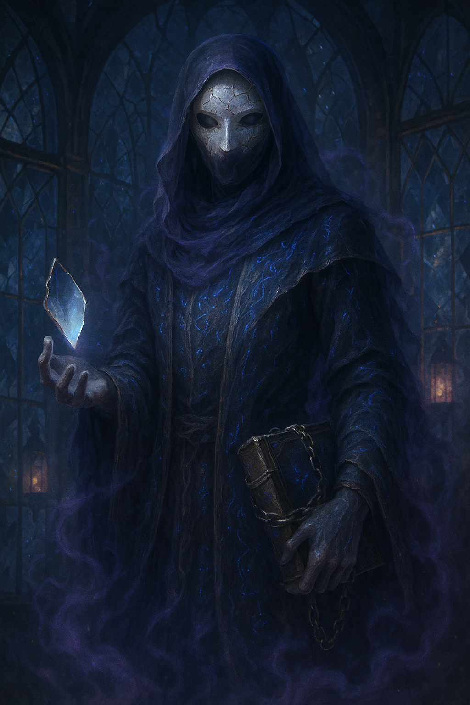

## The Whisperer

*"Do you hear them too? The ones behind the mirror?"*

**Faction**: Dark  
**Origin**: The Whispering Woods  
**Role**: Keeper of Forgotten Knowledge  
**Sanctuary**: The Hall of Echoes  
**Weapon**: Mirror Fragment, Chained Tome

---

Some say **The Whisperer** was never truly born, only assembled — a soul stitched from fragments of voices lost in time. They are a being of reflection and riddles, wrapped in veils of silver fog and secrets too heavy for the sane.

In the deepest glades of the **Whispering Woods**, mirrors hang from branches like rotten fruit. In their surface flicker things that should not be. There, the Whisperer lingers — not quite seen, not quite gone — bound to a shattered tome and a mirror that reflects not form, but fate.

They speak rarely, and when they do, it is often in riddles or voices not their own. Listening too long may unravel your sense of self.

---

### 🕊 Gameplay Effect

> *Randomly steal 1 card from your opponent’s hand and resolve its effect immediately.*

---

### 🃏 Tarot Meaning

**Upright** — *Insight, hidden truths, introspection, memory recovered.*  
What is lost is not always gone. Sometimes it waits, whispering.

**Reversed** — *Confusion, delusion, self-deception, echo without source.*  
You may be listening too closely. Be careful what truths you think you’ve found — they may be reflections of your own madness.
