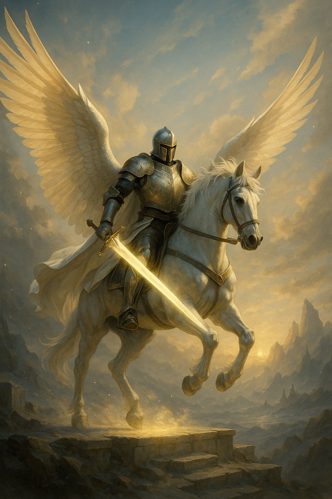

## The Winged Knight

*"I do not fly to escape. I fly to strike."*

**Faction**: Light  
**Origin**: The Sacred Peaks  
**Role**: Divine Vanguard  
**Sanctuary**: The High Aerie  
**Weapon**: Wings of astral steel, blade of starfire

---

He descended from the clouds when the Scattering began — not as a savior, but as a sword.

**The Winged Knight** is the sharp edge of justice, clad in radiant armor that glints with celestial fire. His wings, forged by the Astrals in forgotten aeons, beat not for glory, but for purpose. To see him fall from the heavens is to witness judgment.

He speaks little. His creed is written in motion, in strikes too fast for the eye, in justice delivered without hesitation.

He exists not to rule, but to defend the light — especially from what once was light.

---

### 🕊 Gameplay Effect

> *Cancel The Hex when it attempts to steal a magical stone.*

---

### 🃏 Tarot Meaning

**Upright** — *Judgment, swift action, divine retribution, purity of purpose.*  
Now is the time to act — with clarity, with strength, with honor. Strike only when your heart is sure.

**Reversed** — *Rashness, false justice, rigidity, loss of flight.*  
Beware the illusion of righteousness. Your wings may be strong, but are they lifting you — or blinding you?
