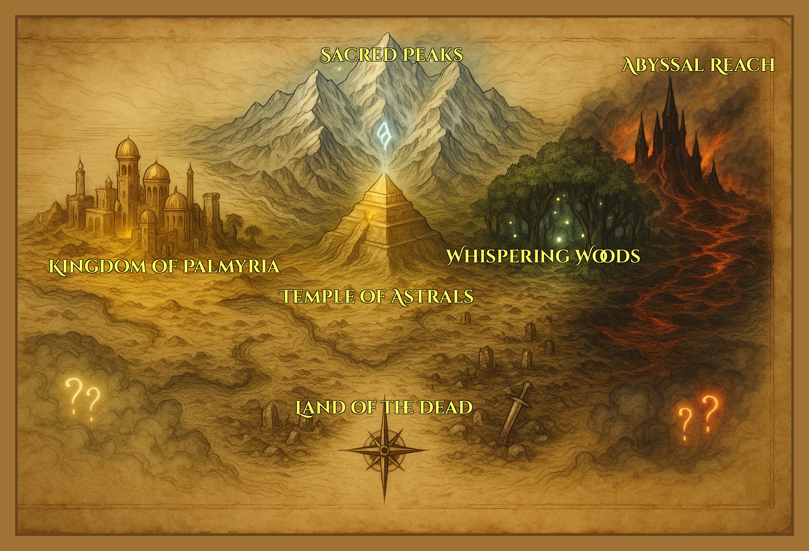

# ✦ Lore of Nytherria ✦  
*For the game: Nytherria – War for the Magical Stones*

---

## ❖ The Beginning: Aether and the Astrals

In the beginning, there was only **Aether** — the primal essence of existence, from which life and magic draw their strength.

From Aether emerged the **Astrals** — ancient, highly intelligent beings who shaped reality itself. They nurtured the first civilizations and brought structure to chaos. To empower creation, they forged the **Stone of Life**, a perfect crystallization of pure Aether.

From that single Stone, the world of **Nytherria** was born. Forests grew, oceans filled, and stars found their patterns. Magic flowed naturally, and under the Astrals' silent guidance, life flourished in perfect harmony.

---

## ❖ The Fall: The Great Shattering

When the Astrals saw that the mortal races had matured, they **retreated into the Void**, choosing to slumber for eternity — until the next cycle of rebirth.

But in their absence, balance faltered.

Without divine guidance, the people of Nytherria grew **ambitious**, **greedy**, and **reckless**. Magic was exploited. The **Stone of Life** — the wellspring of all — was overharvested, drained of its power for war, wealth, and dominion.

Eventually, it could take no more. The Stone exploded, causing **The Great Shattering**.

The explosion shattered the world into fragmented, desolate lands, dividing the once-unified realm into **seven war-torn regions**. Thus began the **Age of Desolation**.

---

## ❖ The Gift: Magical Stones and the Temple

But not all hope was lost.

Before retreating to the Void, the Astrals foresaw the coming collapse. As a final act of mercy, they forged **Magical Stones** — hollow fragments of the original Stone of Life — and enshrined them deep within the **Temple of the Astrals**.

In the death-cry of the now-shattered Stone of Life, these stones absorbed the **life energy** caused by the explosion, and in turn radiate pure Aether. They are the last remnant of balance, capable of nurturing rebirth.

Ironically, they also became the fuel for war.

Each faction seeks to claim the stones — not for healing, but for power. And so, the **War for the Magical Stones** begins...

---

## ❖ Timeline of Key Events

| Era                      | Event Description |
|--------------------------|-------------------|
| **Primordial Age**       | Aether exists. The Astrals arise. They forge the Stone of Life. |
| **Era of Harmony**       | Nytherria is born. Life flourishes under Astral guidance. |
| **Void Departure**       | Astrals retreat. Civilizations thrive in free-will — then destabilize. |
| **The Great Shattering** | The Stone of Life explodes. The world breaks into seven hostile regions. The Magical Stones left behind by the Astrals absorbs the Stone of Life death-cry. |
| **Age of Desolation**    | Factions rise, fighting over Magical Stones left behind. |

---

## ❖ The Seven Regions of Nytherria

1. **Palmyria** – The Last Kingdom of Men. Now fractured but proud, clinging to light.
2. **The Sacred Peaks** – A glacial land of silence, wisdom, and forgotten temples.
3. **Whispering Woods** – A large forest of lies, illusions, and long-buried betrayal.
4. **Temple of the Astrals** – The central ruin where the Stones now reside, echoing with divine memory.
5. **Abyssal Reach** – A volcanic wasteland of fire, fury, and corrupted power.
6. **Land of the Dead** – A desolate cursed field of ghosts, necromancy, and undying warriors. Great battles once fought here, now no living soul can bear it.
7. **Undiscovered Lands** remain at the world’s edges — hidden, sealed, or forgotten…

---

## ❖ Factions and the Stones

The **Magical Stones** are all that remain of the original Stone of Life. They pulse with Aether — energy enough to **restore** or **destroy**.

The factions split along philosophy:

- **The Light** believe in using the stones to heal and rebuild the world.
- **The Dark** believe the old world must be replaced with one forged by strength and will.
- **The Undead** seek only to break the cycle of life and death entirely.

No side is wholly right. No war is bloodless. But the one who controls the Stones controls the future.

---

## ❖ Present Day

Champions rise across Nytherria — saints, warlocks, soldiers, reapers — each drawn to the echo of the Stones.

Some are driven by hope. Others by vengeance. All know this:

> *The Astrals will not wake again. The fate of the world now lies in mortal hands.*

---

> For character bios and abilities, see [characters.md](characters.md)  
> For gameplay rules, see [rules.md](rules.md)
